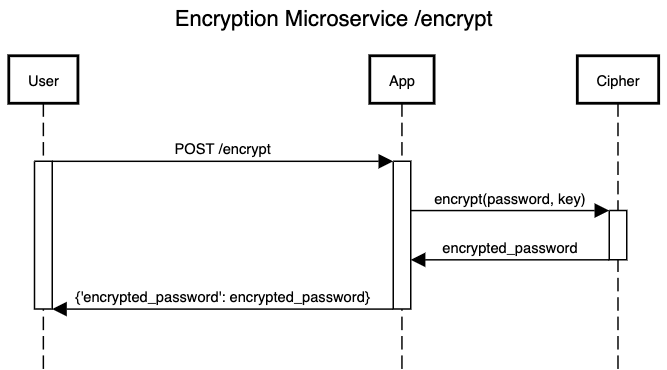

### Programmatically Request and Receive Data from the Encryption Microservice
In Python, you can use the requests library ro make POST requests to each endpoint, with the password and key passed in the body, then save the response as a local variable. Each response will come back as JSON. Fully implemented example calls can be found in the eaxmple_calls.py file.

#### Example POST request to the /encrypt endpoint:
```
response = requests.post("http://127.0.0.1:9001/encrypt", json={
    "password": "secret-password",
    "key": "encryption-key"
})
```
Extract the JSON data from the HTTP response.
```encrypted_data = response.json()```

#### Example POST request to the /decrypt endpoint:
```
response = requests.post("http://127.0.0.1:9001/decrypt", json={
    "encrypted_password": encrypted_password,
    "key": "encryption-key"
})
```
Extract the JSON data from the HTTP response.
```decrypted_data = response.json()```

Results from the example calls:
```
Encrypted Data: zuh("(C{r%B&v/k
Decrypted Data: secret-password
```

Make sure that the microservice is running and accessible at the specified URLs (http://127.0.0.1:9001/encrypt and http://127.0.0.1:9001/decrypt). Also, ensure that you have the requests library installed in your Python environment (pip install requests). These examples demonstrate how to send data to the microservice and handle the JSON responses accordingly.

### UML Sequence Diagrams





Formal API specification: 
```
POST /encrypt
Content-Type: application/json

Request Body: 
{ 
"password": string,
"key": string
}

Response Body: {
"encrypted_password": string,
}

POST /decrypt
Content-Type: application/json

Request Body: 
{ 
"password": string,
"key": string
}

Response Body: {
"decrypted_password": string,
}
``````
